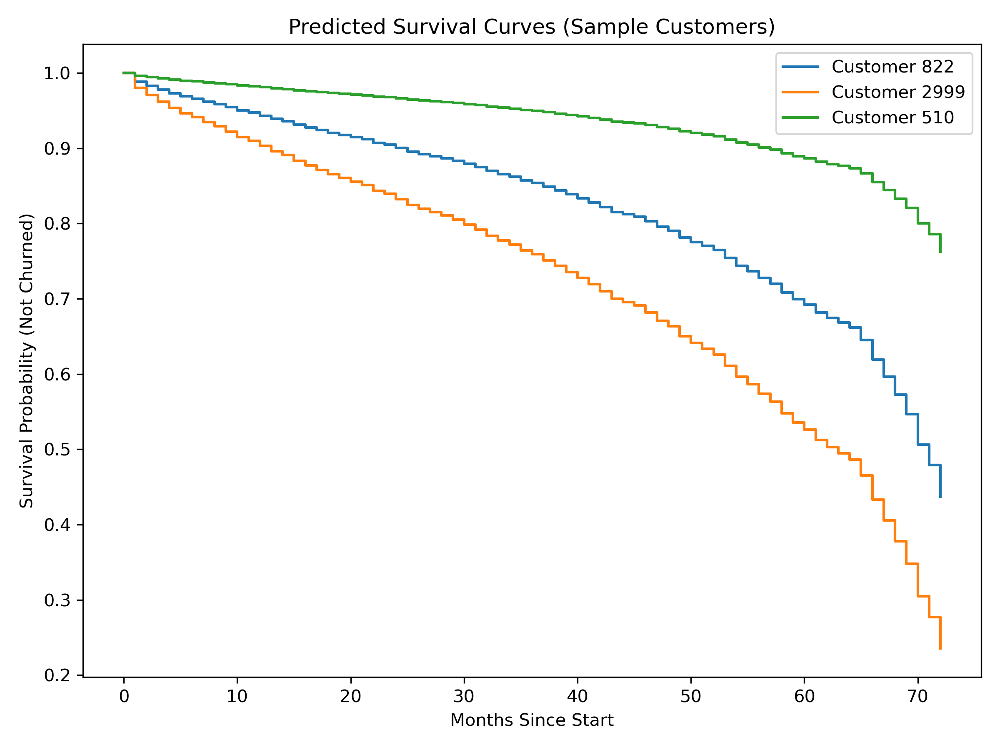
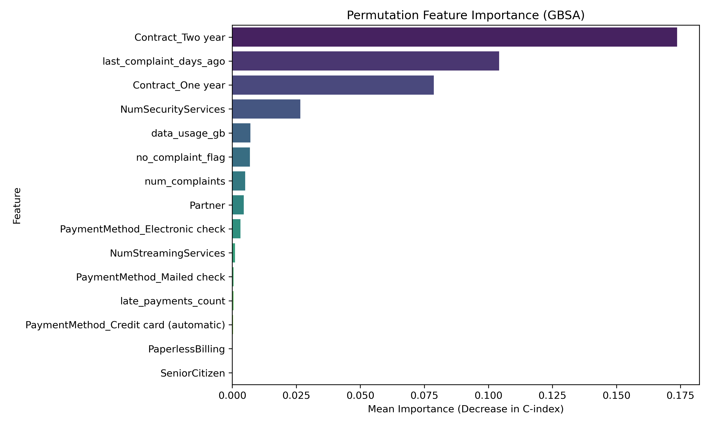
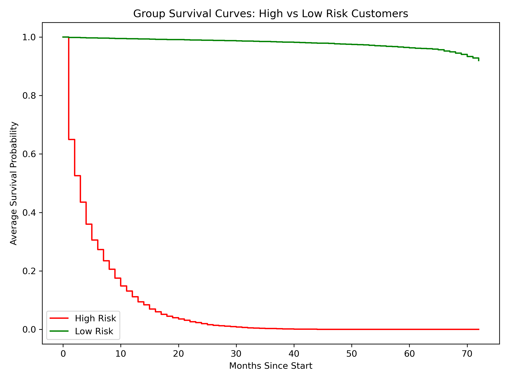

# Telecom Customer Churn Analysis with Survival Models



## Executive Summary
This repository presents a **comprehensive end-to-end churn analysis project** for a telecom company.  
It covers the full data science lifecycle — from raw data exploration to **production-ready survival modeling** and deployment via **Streamlit**.  

Key achievements:
- Built advanced **survival analysis models** (Cox PH, Accelerated Failure Time, Random Survival Forest, Gradient Boosting Survival Analysis).  
- Engineered **behavioral synthetic features** (complaints, recency, payments, discounts, data usage).  
- Achieved **state-of-the-art performance** with a **C-index of 0.9113** using GBSA + engineered features.  
- Delivered actionable business insights (e.g., *“customers with recent complaints are 4x more likely to churn within 6 months”*).  
- Deployed an **interactive Streamlit app** for real-time prediction, survival curve visualization, and explainability with SHAP.  

---

## Repository Structure
```
├── models/ # Trained survival models & feature JSON
├── data/ # Raw and cleaned telecom datasets
├── notebooks/ # Jupyter notebooks (EDA, feature engineering, modeling)
├── plots/ # Saved figures (diagnostics, curves, importance plots)
├── app.py # Streamlit app for interactive churn prediction
├── requirements.txt
└── README.md
```
---

## Project Objectives
1. **Understand churn drivers** with exploratory analysis.  
2. **Model time-to-churn** using survival techniques.  
3. **Engineer realistic synthetic behavioral features** to simulate real-world telecom usage.  
4. **Benchmark models** and select the best one for prediction vs interpretability.  
5. **Translate insights into business strategies** for retention and lifetime value maximization.  
6. **Deploy a professional web app** for predictions and visual storytelling.  

---

## Data Preparation
- Imputed missing `TotalCharges` (new customers with `tenure=0`) → set equal to `MonthlyCharges`.  
- Handled collinearity: dropped `TotalCharges` due to high VIF.  
- Mapped “No internet service” into `"No"` for add-ons.  
- Engineered **NumSecurityServices** and **NumStreamingServices** by summing individual add-ons.  
- Applied log transforms & restricted cubic splines for non-linear features.  

---

## Exploratory Data Analysis (EDA)
- **Target balance**: 73.5% non-churn, 26.5% churn.  
- **High churn groups**:  
  - Early tenure customers (0–6 months).  
  - Month-to-month contracts.  
  - Electronic check payers.  
  - Fiber optic internet users.  
- **Loyal group**: Customers with no internet service (low churn).  
- **Cost impact**: High `MonthlyCharges` = elevated churn risk.  

---

## Survival Analysis
- **Duration** = tenure (months).  
- **Event** = churn (1) / censored (0).  

### Kaplan–Meier Curves
- Two-year contracts: survival >85% even at 72 months.  
- Month-to-month contracts: survival <30% by 40 months.  
- Electronic check payments: fastest hazard rise.  

### Hazard Insights
- Sharpest risk: **0–15 months** of tenure.  
- By 24 months: survival drops to ~79%.  

---

## Synthetic Feature Engineering
Five behavioral features were simulated:
- **`num_complaints`** (Poisson)  
- **`last_complaint_days_ago`** (Uniform) + **`no_complaint_flag`**  
- **`data_usage_gb`** (Normal)  
- **`late_payments_count`** (Poisson)  
- **`discount_received`** (Bernoulli)  

Diagnostics confirmed they introduced **realistic predictive signals**:
- Recent complaints → strongest churn driver.  
- High data usage → higher risk of leaving.  
- Discounts alone → weak retention effect.  

---

## Modeling & Benchmarking
### Baseline (no synthetics)
- Cox PH → **C-index 0.86**  
- Log-Normal AFT → **C-index 0.86**  
- RSF → **C-index 0.85**  
- GBSA → **C-index 0.8641**  

### With Synthetic Features
- Cox PH → 0.8917  
- Log-Normal AFT → 0.1077 (unstable)  
- RSF → 0.8996  
- **GBSA → 0.9113 (best)**  

**Final choice:**  
- **GBSA** = production model (best accuracy).  
- **Cox PH** = interpretable companion.  

---

## Key Insights & Business Strategies
- **Contract upgrades**: Two-year contracts increase lifetime value **5–14x**.  
- **Early tenure**: Most critical 0–10 months. Proactive outreach reduces losses.  
- **Security services**: Customers with add-ons extend tenure by **74%**.  
- **Payments**: Electronic check users churn 1.8x faster → incentivize auto-pay.  
- **Complaints**: Customers with recent complaints are **4x more likely to churn within 6 months**.  
- **Late payments**: Linked to ~2x faster churn.  
- **Discounts**: Ineffective in isolation → combine with loyalty/quality improvements.  

---

## Streamlit App
The **production Streamlit app** (`app.py`) enables:
- **Interactive customer profiling** (contracts, services, complaints, usage).  
- **Predicted survival curves** for individuals.  
- **Relative churn risk score** + **median survival time**.  
- **Automated business suggestions** (contract upgrade, service recovery, etc).  
- **SHAP explainability** with waterfall plots for transparency.  
- **Diagnostic visuals**:  
  - Permutation Feature Importance  
  - Sample Predicted Survival Curves  
  - Group Survival Curves (High vs Low Risk)
---
## Live Demo
Try the interactive app here: [Streamlit App](https://telecom-churn-survival-kdj4ca5aikobrbdeorqssv.streamlit.app/)

*(Hosted on Streamlit Cloud — may take a few seconds to load on first run)*

### Example Screenshots

| Permutation Importance | Sample Survival Curves | Group Curves |
|------------------------|-------------------------|--------------|
|  |  |  |

---

## Installation & Usage
### Clone the repo
```bash
git clone https://github.com/zeeshan-akram-ds/telecom-churn-survival.git
cd telecom-churn-survival
```
### Install dependencies
```bash
pip install -r requirements.txt
```
### Run the app
```bash
streamlit run app.py
```
---
## Results at a Glance

- **Best model**: GBSA with synthetic features.
- **Performance**: C-index 0.9113.
- **Business Impact**: Potential to increase customer lifetime value by 5–14x through retention tactics.

## Conclusion & Next Steps

This project showcases how advanced survival analysis + synthetic behavioral features can transform raw telecom data into strategic retention actions.

### Next steps:
- Integrate with live customer databases.
- Automate scoring pipelines (batch or API).
- Expand synthetic features using real call center / billing system data.

## Author

- **Zeeshan Akram**
- Data Scientist | Survival Analysis | Machine Learning for Business Impact
- 🔗 [LinkedIn](https://www.linkedin.com/in/zeeshan-akram-572bbb34a) · [GitHub](https://github.com/zeeshan-akram-ds)
